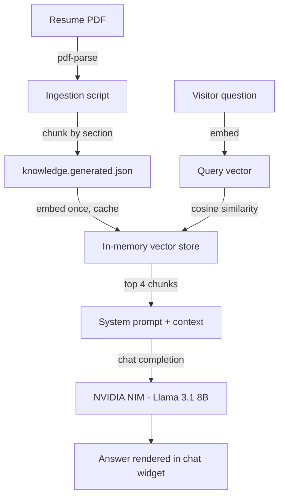

# Dev Patel — AI Engineer Portfolio

A portfolio site with a twist: instead of just describing my work, it **answers questions about it**. A RAG-powered chat assistant lives on the homepage, grounded in my actual resume and project case studies — ask it anything about my background and it retrieves real facts before answering, rather than guessing.

**Live site:** [personal-portfolio-iota-self-92.vercel.app](https://personal-portfolio-iota-self-92.vercel.app)
**Repo:** [github.com/devpatel6780/PersonalPortfolio](https://github.com/devpatel6780/PersonalPortfolio)

---

## Why this isn't just another portfolio template

Most portfolio sites are static — a list of projects and a contact form. This one ships an actual piece of AI infrastructure alongside the marketing copy:

- A **document ingestion script** parses my real resume PDF and chunks it by section (skills, each job, education) — not hand-typed text.
- Each chunk is converted into a **real vector embedding** via NVIDIA NIM's embedding model.
- Every question a visitor asks gets embedded too, and matched against those vectors with cosine similarity to find the most relevant facts.
- Only the retrieved facts are handed to an LLM to generate the answer — the model can't make things up about me that aren't in the source data, and it's instructed to say so (and point to my email) when it doesn't know something.
- It also knows when to **refuse**: ask it about something unrelated to me, and it redirects instead of answering off-topic questions.

This page exists because I wanted my portfolio to demonstrate the exact class of system I actually build — retrieval-augmented generation — rather than just claim it in a bullet point.

---

## How the chatbot works



| Stage | Implementation |
|---|---|
| **Ingestion** | [`scripts/ingest-resume.mjs`](scripts/ingest-resume.mjs) parses the resume PDF with `pdf-parse`, splitting it into structured chunks (summary, 11 skill categories, 3 job entries, education, contact) using section-header and date-range regex matching. |
| **Embedding** | [`lib/nvidia.ts`](lib/nvidia.ts) calls NVIDIA NIM's `nv-embedqa-e5-v5` model (OpenAI-compatible API) to turn each chunk — and every incoming question — into a vector. |
| **Retrieval** | [`lib/retrieval.ts`](lib/retrieval.ts) embeds the knowledge base once and caches it in memory, then ranks chunks against the query by cosine similarity, returning the top 4. |
| **Generation** | [`app/api/chat/route.ts`](app/api/chat/route.ts) builds a guardrailed system prompt from the retrieved chunks and calls NVIDIA NIM's `meta/llama-3.1-8b-instruct` for the final answer. |
| **UI** | [`components/ChatWidget.tsx`](components/ChatWidget.tsx) — a floating chat bubble available on every page. |

**Worth knowing — what this is and isn't:** the vector "store" is an in-memory array, not a dedicated vector database (FAISS/Pinecone). At ~17 chunks, brute-force cosine similarity is the *correct* engineering choice — it's faster than building an index would be at this scale, and a real vector DB only pays off with much larger corpora or persistence requirements neither of which apply here. Embeddings and retrieval are genuinely computed on every request; nothing is hardcoded.

To regenerate the knowledge base after updating the resume:
```bash
npm run ingest
```

---

## Features

- **Animated hero** with a live, ticking system-metrics panel (requests/sec, latency, retrieval accuracy)
- **Selected Work** — real project case studies with results, not just descriptions
- **Experience timeline**, **Education**, and a full **Tech Stack** breakdown pulled from my actual resume
- **Working contact form** that sends real email via Resend, with reply-to wired to the visitor's address
- **RAG chat assistant** (see above) — the centerpiece
- Dark, glassmorphic UI with Framer Motion micro-interactions throughout

---

## Tech stack

| Layer | Choice |
|---|---|
| Framework | Next.js 16 (App Router, Turbopack) |
| Language | TypeScript |
| Styling | Tailwind CSS v4 |
| Animation | Framer Motion |
| Icons | lucide-react |
| Chat LLM + embeddings | NVIDIA NIM (OpenAI-compatible API) |
| Email | Resend |
| PDF parsing | pdf-parse |

---

## Getting started

```bash
git clone https://github.com/devpatel6780/PersonalPortfolio.git
cd PersonalPortfolio
npm install
```

Create a `.env.local` file with:

```bash
RESEND_API_KEY=your_resend_api_key       # resend.com — powers the contact form
NVIDIA_API_KEY=your_nvidia_api_key       # build.nvidia.com — powers the chat assistant
```

Run the dev server:

```bash
npm run dev
```

Open [http://localhost:3000](http://localhost:3000).

### Other scripts

```bash
npm run build     # production build
npm run start     # serve the production build
npm run lint      # lint
npm run ingest    # re-parse the resume PDF into lib/knowledge.generated.json
```

> Note: the actual resume PDF is gitignored and not included in this repo. The parsed knowledge chunks it produces (`lib/knowledge.generated.json`) are committed, so the chatbot works out of the box without needing the source PDF.

---

## Project structure

```
app/
  api/chat/route.ts        RAG endpoint: retrieval + generation
  api/contact/route.ts     Contact form email endpoint (Resend)
  work/[slug]/page.tsx     Project case-study detail pages
  page.tsx                 Home page — composes all sections

components/
  ChatWidget.tsx           Floating RAG chat UI
  Hero.tsx                 Animated hero + live metrics panel
  AboutSection.tsx, Services.tsx, WorkSection.tsx,
  Experience.tsx, Education.tsx, TechStack.tsx, Contact.tsx, Footer.tsx
  ui/                      Nav, custom cursor, shared primitives

lib/
  knowledge.ts             Merges resume-derived + project chunks
  knowledge.generated.json Output of the ingestion script
  retrieval.ts             Embedding cache + cosine-similarity search
  nvidia.ts                NVIDIA NIM client (embeddings + chat)
  projects.ts              Project case-study data

scripts/
  ingest-resume.mjs        Resume PDF -> structured knowledge chunks
```

---

## Contact

- Email: devp70431@gmail.com
- LinkedIn: [linkedin.com/in/devrakeshpatel](https://www.linkedin.com/in/devrakeshpatel/)
- GitHub: [github.com/devpatel6780](https://github.com/devpatel6780)

Or just ask the chatbot on the site — that's what it's for.
